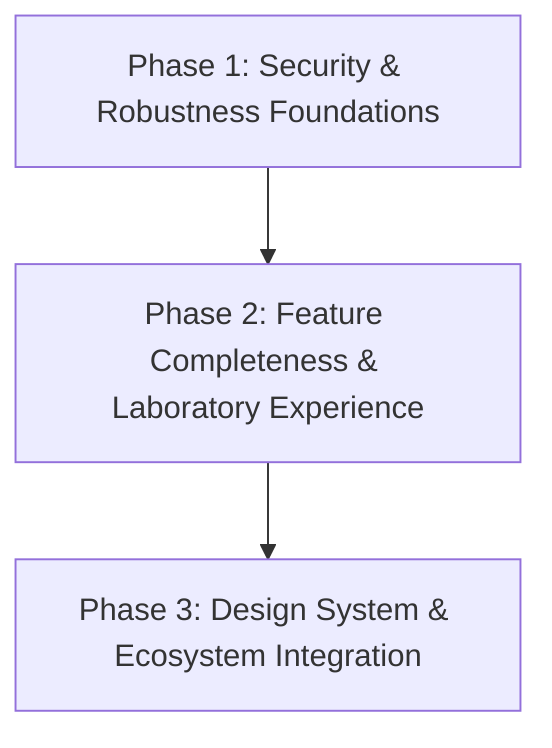

# CS4S Modernization & Migration Roadmap

This document outlines the comprehensive engineering roadmap to evolve **Client-Server 4 Students (CS4S)** from its current prototype state into a mature, high-quality educational client-server network laboratory.

This roadmap is designed to achieve **Product Maturity** (a Minimal Lovable Product, or MLP), rather than a minimum viable release. It represents the complete destination under Sxnnyside quality and educational standards, detailing all required capabilities without scope deferral.

---

## 1. Migration Strategy
We follow an incremental **"Hardening First, Features Second, Polish Last"** strategy, preserving the core PyQt6 signal-slot background thread architecture while refactoring logic into clean, domain-specific epics:

1. **Security & Robustness (Phase 1):** Stabilize transport engines, socket lifecycles, and core namespace security.
2. **Feature Parity & Laboratory Experience (Phase 2):** Establish complete file actions, platform portability, protocol design, and the interactive educational core.
3. **Ecosystem & Polish (Phase 3):** Standardize toolchains, modernize cryptography, and build contribution frameworks.

---

## 2. Migration Phases & Epics

### Phase 1: Security & Robustness (Hardening)

#### Epic 1: Streaming Transfer Engine
*   **Objective:** Replace the current in-memory transfer scheme with a robust, buffered socket streaming engine.
*   **Scope:**
    *   Implement chunked (4KB buffer) read/write streams on client and server socket backends.
    *   Develop thread-safe progress callbacks to update the GUI dynamically.
    *   Integrate transfer cancellation hooks that cleanly abort transfers without socket corruption.
    *   Implement non-blocking visual queue indicators in the UI to notify users when multiple transfers are scheduled.
*   **Complexity:** *Medium* | **Priority:** *Critical*

#### Epic 2: Connection Lifecycle
*   **Objective:** Standardize the socket connection loop, thread dispatching, and cleanup routines.
*   **Scope:**
    *   Handle connect, disconnect, and socket timeouts safely, preventing UI freezes.
    *   Re-engineer background worker threads to exit cleanly on disconnect.
    *   Implement socket shutdown routines to prevent lingering processes or port locking.
    *   Implement auto-reconnect logic and detailed, user-friendly error handlers for network timeouts.
*   **Complexity:** *Medium* | **Priority:** *High*

#### Epic 3: Server Security & Hardening
*   **Objective:** Secure the server boundaries against malicious inputs and resource abuse.
*   **Scope:**
    *   Add regex username sanitization to block path traversal folder allocation.
    *   Enforce configuration connection limits (`max_connections`) in the accept loop, rejecting excess clients cleanly.
    *   Introduce session validations and rate-limiting rules to prevent connection floods.
*   **Complexity:** *Low* | **Priority:** *High*

#### Epic 4: Test Infrastructure
*   **Objective:** Establish test automation to ensure protocol and logic changes do not cause regression.
*   **Scope:**
    *   Integrate `pytest` and `pytest-qt` into the development loop.
    *   Write integration tests verifying client-server handshake, auth validation, and standard exceptions.
    *   Write regression tests for file transfers and path traversal attempts.
*   **Complexity:** *Medium* | **Priority:** *Medium*

---

### Phase 2: Feature Completeness & Laboratory Experience (Standardization)

#### Epic 5: Protocol Evolution
*   **Objective:** Define, version, and extend the custom client-server application protocol as a standalone product asset.
*   **Scope:**
    *   Introduce protocol versioning handshakes and client-server capability negotiation.
    *   Standardize structured error codes (resembling numeric HTTP/FTP codes) for robust client parsing.
    *   Define protocol schemas and validation rules for new commands (DELETE, RENAME, MOVE).
    *   Design syntax validation routines to reject malformed packets at the socket gateway.
*   **Complexity:** *Medium* | **Priority:** *High*

#### Epic 6: File Management
*   **Objective:** Implement file manager behaviors on the user interface and storage layers using the defined protocol commands.
*   **Scope:**
    *   Implement filesystem DELETE, RENAME, and MOVE operations in `FileManager`.
    *   Wire these actions to client GUI controls and directory list updates.
    *   Ensure recursive directory creation/management works safely.
*   **Complexity:** *Low* | **Priority:** *High*

#### Epic 7: Runtime Environment
*   **Objective:** Remove hardcoded repository paths and enable isolated OS environment deployment.
*   **Scope:**
    *   Decouple preferences, user database, logs, and sandbox storage from `PROJECT_ROOT`.
    *   Resolve dynamic paths to standard user data storage (AppData on Windows, `~/.local/share` on macOS/Linux).
    *   Implement an explicit "Portable Mode" switch via configuration files.
*   **Complexity:** *Medium* | **Priority:** *Medium*

#### Epic 8: Educational Experience (Strategic Core)
*   **Objective:** Evolve the GUI from a file explorer into an interactive client-server network laboratory.
*   **Scope:**
    *   *Note:* This is a master domain epic that will decompose into **7 distinct sub-feature packages** during development:
        1.  **Protocol Inspector:** A real-time console rendering command exchanges (e.g., `-> AUTH`, `<- OK AUTH_OK`).
        2.  **Packet Explanations:** Contextual tooltips explaining the purpose and arguments of each protocol command.
        3.  **Socket State Visualizer:** Real-time visibility into active connection states (LISTEN, ESTABLISHED, CLOSE_WAIT, etc.) and connection parameters.
        4.  **Raw Command Console:** Interface allowing students to type and send raw protocol strings directly to test server responses.
        5.  **Connection Graph:** Visual node map showing multiple connected clients mapped to the active server.
        6.  **Live Statistics:** Real-time metrics showing connection throughput (KB/s), Round-Trip Time (RTT), packet count, and error rates.
        7.  **Teacher Mode:** Admin controls to inject simulated network latency, packet loss, or socket disconnections to teach students error recovery.
*   **Complexity:** *High* | **Priority:** *High*

---

### Phase 3: Ecosystem (Polish)

#### Epic 9: MintPy Foundation
*   **Objective:** Standardize layout configurations and visual structures under the emerging MintPy Design System.
*   **Scope:**
    *   Extract stylesheets into reusable QSS variables and design tokens.
    *   Refactor inputs, tables, list widgets, and progress controls into a shared components library.
    *   Incorporate desktop accessibility standards (tab orders, focus states, screen reader labels).
*   **Complexity:** *Medium* | **Priority:** *Low*

#### Epic 10: Security Modernization
*   **Objective:** Introduce modern cryptography and secure transport structures.
*   **Scope:**
    *   Migrate user store hashing from SHA-256 + salt to a work-factored solution (`bcrypt`).
    *   Implement **Optional, Toggleable Transport Layer Security (TLS/SSL)** on raw TCP sockets.
    *   *Pedagogical Rationale:* A runtime toggle allows students to compare encrypted vs. unencrypted traffic in the Protocol Inspector, demonstrating the practical value of TLS in real-time.
*   **Complexity:** *Medium* | **Priority:** *High*

#### Epic 11: Engineering Ecosystem & Developer Experience
*   **Objective:** Standardize build automation, distribution packages, formatting, and educational documentation.
*   **Scope:**
    *   Introduce Poetry (`pyproject.toml`) for environment stability and packaging.
    *   Incorporate static analysis tooling (`ruff` and `mypy`).
    *   Build multi-platform distribution packages (macOS `.app`/`.dmg`, Windows portable `.exe`, and Linux `.deb`/tarball).
    *   Draft an RFC-style formal Protocol Specification Document.
    *   Write a comprehensive Developer Guide for code extension.
    *   Create an Educator Curriculum Guide with classroom networking labs and lesson plans.
*   **Complexity:** *Medium* | **Priority:** *Medium*

---

## 3. Quick Wins
These low-complexity improvements should be tackled immediately:
1.  **Regex username sanitization** in UI forms to block path-traversal injection (`../`).
2.  **Connection limit validation** in `server_backend.py` using `max_connections`.
3.  **F5 shortcut mapping** in the client window to quickly trigger directory refreshes.

---

## 4. Technical Foundations
Prior to feature work, the following must be implemented:
1.  **Testing Harness Setup:** Configure `pytest` and `pytest-qt` to prevent network protocol regressions.
2.  **Configurable Base Directory:** Refactor `ConfigManager`, `AuthManager`, and `FileManager` to accept external root directories.

---

## 5. Success Criteria
*   The server handles large files (500MB+) with RAM usage staying under 50MB.
*   Worker threads exit immediately upon user disconnection with zero thread leaks.
*   Files and folders can be deleted, renamed, and moved from the client UI and update the server dynamically.
*   Client-to-server connections can run fully encrypted under optional TLS mode.
*   Raw TCP protocol strings, live throughput stats, and simulated latency are visual and operational in the GUI.
*   The test suite runs with a single command (`pytest`) and achieves >80% coverage on core protocol modules.
*   The application runs correctly in write-restricted system directories and installs via platform-specific binaries.

---

## 6. Completeness Audit Matrix

To verify that all weaknesses and gaps identified during the Product Validation audit are mapped, the following matrix tracks resolution coverage:

| Audit Finding / Gap | Target Epic | Resolution Details |
| :--- | :--- | :--- |
| **RAM Exhaustion Vulnerability** | **Epic 1: Streaming Transfer Engine** | Replaces `recv_exact` in-memory loading with a chunk-by-chunk stream directly to disk. |
| **Thread-Unsafe Disconnections** | **Epic 2: Connection Lifecycle** | Standardizes safe worker-thread joining and socket closing under locks during teardown. |
| **Missing File Deletion** | **Epic 6: File Management** | Implements filesystem DELETE operations in the storage manager and wires them to UI. |
| **Missing Rename / Move** | **Epic 6: File Management** | Implements RENAME and MOVE operations to achieve file-manager parity. |
| **Protocol Extensions Definition** | **Epic 5: Protocol Evolution** | Defines DELETE, RENAME, and MOVE commands, versioning, and validation schemas. |
| **Ignored Connection Limits** | **Epic 3: Server Security & Hardening** | Enforces `max_connections` validation inside the network accept loop. |
| **Path Traversal via Username** | **Epic 3: Server Security & Hardening** | Validates username input strings upon registration and authentication. |
| **Lack of TLS / Sniffing Risk** | **Epic 10: Security Modernization** | Wraps raw sockets in standard library TLS/SSL with certificate auto-generation. |
| **Silent UI Operation Queuing** | **Epic 1: Streaming Transfer Engine** & **Epic 9** | Adds visual indicators of active transfer queues and non-blocking layout updates. |
| **Hardcoded Path Limitations** | **Epic 7: Runtime Environment** | Relocates dynamic data, preferences, and logs to system-standard directories. |
| **Lack of Testing Framework** | **Epic 4: Test Infrastructure** | Installs and configures `pytest` and `pytest-qt` with baseline mock socket tests. |
| **Hiding Protocol in GUI** | **Epic 8: Educational Experience** | Introduces real-time raw string logs, command senders, and socket state displays. |
| **No Teacher Latency Demos** | **Epic 8: Educational Experience** | Integrates latency, packet loss, and connection disconnect simulation in Teacher Mode. |
| **Missing Docs / Lab Guides** | **Epic 11: Engineering Ecosystem** | Creates a formal RFC protocol spec, developer extension docs, and educator guides. |
| **No Cross-Platform Installer** | **Epic 11: Engineering Ecosystem** | Builds macOS `.dmg` files, Windows portable `.exe`, and Linux `.deb` binaries. |
